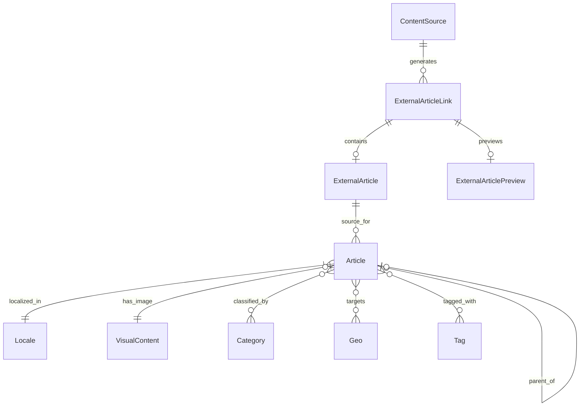

# Архитектура Админ-панели Traffic Arbitration

Этот документ описывает архитектуру административной панели для управления контентом проекта Traffic Arbitration. Архитектура спроектирована на основе анализа существующих моделей данных (`models.py`) и текущей реализации (`admin/routes.py`).

## 1. Обзор компонентов

Админ-панель предназначена для управления полным жизненным циклом контента: от настройки источников и сбора данных до публикации и локализации статей.

### Ключевые сущности:
1.  **Статьи (Articles)**: Основной контент. Поддерживает иерархию, локализацию, SEO (slugs) и связи с таксономиями.
2.  **Конвейер контента (Content Pipeline)**:
    *   **Источники (Content Sources)**: Конфигурация источников для скрапинга.
    *   **Превью (Previews)**: Сырые данные (заголовки, ссылки на картинки), полученные от скраперов.
    *   **Внешние статьи (External Articles)**: Скачанный и обработанный текст из внешних источников.
3.  **Медиа-библиотека (Visual Content)**: Управление загруженными изображениями и файлами.
4.  **Таксономия и Настройки**:
    *   **Локали (Locales)**: Языковые версии.
    *   **Категории, Гео, Теги**: Классификация контента.

---

## 2. Структура Маршрутов (Routes)

Предлагается модульная структура маршрутизации на базе `APIRouter`.

### 2.1. Основной модуль (`/admin`)
*   `GET /`: Дашборд (статистика, последние статьи).

### 2.2. Управление статьями (`/admin/articles`)
*   `GET /`: Список статей с фильтрацией (по дате, источнику, локали, статусу).
*   `GET /create`: Форма создания.
*   `POST /create`: Обработка создания.
*   `GET /{id}/edit`: Форма редактирования.
*   `POST /{id}/edit`: Обработка изменений.
*   `POST /{id}/delete`: Удаление (soft delete или hard delete).
*   `GET /{id}/compare`: Сравнение с внешней статьей (источником).

### 2.3. Конвейер контента (`/admin/pipeline`)
*   **Источники (`/sources`)**:
    *   `GET /`: Список источников.
    *   `POST /create`, `POST /{id}/edit`: Управление конфигурацией скраперов.
*   **Превью (`/previews`)**:
    *   `GET /`: Список новых превью.
    *   `POST /{id}/fetch`: Запустить скачивание полной статьи (перевод в External Article).
*   **Внешние статьи (`/external`)**:
    *   `GET /`: Список скачанных статей.
    *   `GET /{id}/convert`: Форма создания чистовой статьи (`Article`) на основе внешней.

### 2.4. Медиа-библиотека (`/admin/media`)
*   `GET /`: Галерея изображений (`VisualContent`).
*   `POST /upload`: Загрузка новых файлов.
*   `POST /{id}/delete`: Удаление.

### 2.5. Настройки и Таксономия (`/admin/settings`)
*   `GET /locales`, `POST /locales`: Управление языками.
*   `GET /categories`, `POST /categories`: Управление категориями.
*   `GET /geo`, `POST /geo`: Управление гео-метками.
*   `GET /tags`, `POST /tags`: Управление тегами.

---

## 3. Модели Данных и Схемы (Pydantic)

Необходимо расширить `admin/schemas.py` для поддержки новых интерфейсов.

### Существующие (требуют обновления):
*   `ArticleCreate/Update`: Добавить валидацию `slug`.

### Новые схемы:
*   **ContentSource**:
    ```python
    class ContentSourceBase(BaseModel):
        name: str
        domain: str
        source_handler: str
        is_active: bool
    ```
*   **VisualContent**:
    ```python
    class VisualContentResponse(BaseModel):
        id: int
        name: str
        url: str  # Сгенерированный URL для отображения
        width: int
        height: int
    ```
*   **Locale**:
    ```python
    class LocaleBase(BaseModel):
        code: str
        name: str
    ```

---

## 4. Интеграции и Шаблоны

### Шаблоны (Jinja2)
Структура директории `templates/`:
```
admin/templates/
├── layouts.html          # Базовый макет с навигацией
├── dashboard.html        # Главная страница
├── articles/             # Существующие шаблоны
│   ├── list.html
│   ├── form.html
│   └── compare.html
├── pipeline/             # Новые шаблоны конвейера
│   ├── sources_list.html
│   ├── previews_list.html
│   └── external_list.html
├── media/                # Медиа-менеджер
│   └── gallery.html
└── settings/             # Управление таксономией
    └── taxonomy_list.html
```

### Навигация
Обновление `layouts.html` для включения боковой панели или выпадающих меню:
*   **Content**: Articles, Media
*   **Inbound**: Previews, External Articles
*   **Configuration**: Sources, Locales, Taxonomy

### Интеграция с моделями
*   Использование `sqlalchemy.orm.Session` для всех операций БД.
*   Обработка изображений через `PIL` (Pillow) при загрузке в `VisualContent`.
*   Генерация `slug` при создании/редактировании статьи (автоматически из заголовка, если не указан).

---

## 5. Диаграмма связей компонентов



---

## 6. Безопасность и Доступ

*   **Аутентификация**: Использование существующего механизма `verify_credentials` (Basic Auth / Token).
*   **Роли**: На данном этапе предполагается одна роль "Администратор" с полным доступом.
*   **Защита**: CSRF защита для форм (через FastAPI dependencies или middleware), валидация входных данных через Pydantic.

---

## 7. План реализации

1.  **Рефакторинг маршрутов**: Разделение `admin/routes.py` на подмодули (например, `admin/routers/articles.py`, `admin/routers/media.py`) для лучшей поддерживаемости.
2.  **UI Обновление**: Добавление разделов в навигацию.
3.  **Реализация CRUD Источников**: Интерфейс для добавления/отключения скраперов.
4.  **Реализация Медиа-менеджера**: Просмотр и загрузка картинок отдельно от статей.
5.  **Внедрение Slug**: Обновление форм статей для работы с полем `slug`.